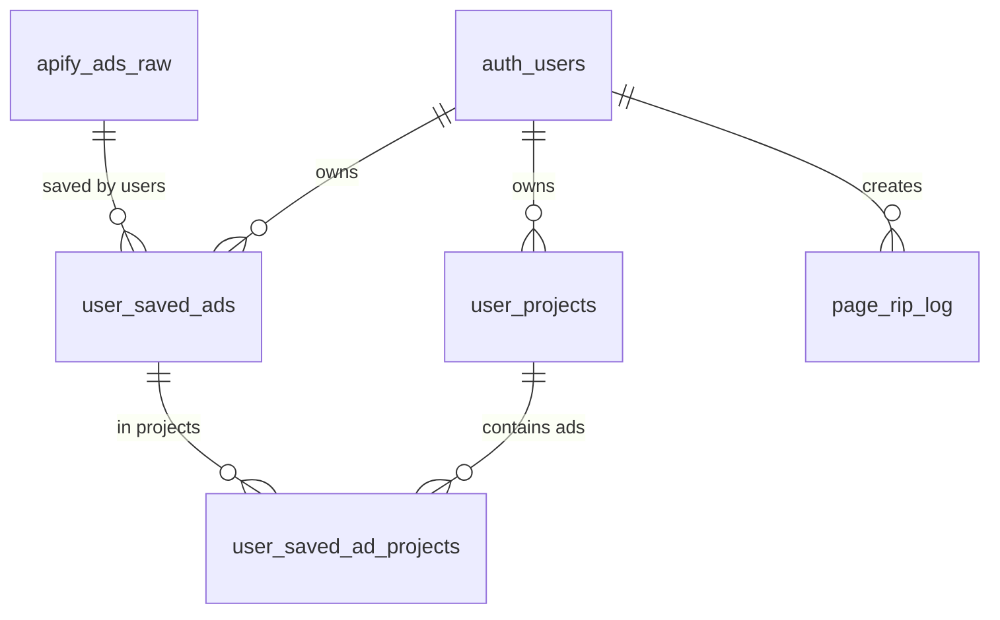

AdRecon uses Supabase (PostgreSQL) for data persistence. The schema is organized around ad storage, user saves, projects, and integrations.

## Core Tables

### apify_ads_raw

Source table for all ad data. Contains raw ad metadata from Meta Ad Library scrapers.

<ResponseField name="ad_archive_id" type="text" required>
  Primary key. Meta Ad Library archive ID (e.g., `123456789012345`).
</ResponseField>

<ResponseField name="page_name" type="text">
  Advertiser page name from Meta.
</ResponseField>

<ResponseField name="snapshot" type="jsonb">
  Structured ad snapshot from Meta Ad Library API. Contains fields like:
  - `title`: ad headline
  - `body.text`: ad copy
  - `link_url`: destination URL
  - `cta_text`: call-to-action button text
  - `images`: array of image objects with `original_image_url`, `resized_image_url`
  - `videos`: array of video objects with `video_hd_url`, `video_sd_url`, `video_preview_image_url`
  - `cards`: carousel cards with media + link data
</ResponseField>

<ResponseField name="media" type="jsonb">
  Normalized media URLs:
  - `imageUrls`: array of image URLs
  - `videoUrls`: array of video URLs
  - `previewImageUrls`: array of video preview/thumbnail URLs
</ResponseField>

<ResponseField name="raw" type="jsonb">
  Full raw scraper payload. Fallback source for fields not in `snapshot`.
</ResponseField>

<ResponseField name="source_url" type="text">
  Original landing page URL if captured during scraping.
</ResponseField>

<ResponseField name="ad_library_url" type="text">
  Direct link to the ad in Meta Ad Library (e.g., `https://www.facebook.com/ads/library/?id=...`).
</ResponseField>

<ResponseField name="start_date" type="timestamptz">
  When the ad first went live. Used to compute `days_running`.
</ResponseField>

<ResponseField name="is_active" type="boolean">
  Whether the ad is currently running. Mapped to `Active`/`Inactive` status in feed views.
</ResponseField>

<ResponseField name="updated_at" type="timestamptz">
  Last time the row was updated. Fallback for `days_running` when `start_date` is null.
</ResponseField>

<ResponseField name="created_at" type="timestamptz">
  Row creation timestamp.
</ResponseField>

---

### user_saved_ads

Per-user saved ads. Junction table linking users to ads they've bookmarked.

<ResponseField name="user_id" type="uuid" required>
  References `auth.users(id)`. Defaults to `auth.uid()`. Cascade deletes when user is deleted.
</ResponseField>

<ResponseField name="ad_archive_id" type="text" required>
  References `apify_ads_raw(ad_archive_id)`. Cascade deletes when ad is removed.
</ResponseField>

<ResponseField name="created_at" type="timestamptz">
  When the ad was saved.
</ResponseField>

<ResponseField name="updated_at" type="timestamptz">
  Auto-updated via trigger `trg_user_saved_ads_updated_at`.
</ResponseField>

**Primary Key:** `(user_id, ad_archive_id)`

**Indexes:**
- `idx_user_saved_ads_user` on `user_id`
- `idx_user_saved_ads_ad` on `ad_archive_id`

---

### user_projects

User-created folders for organizing saved ads.

<ResponseField name="id" type="uuid" required>
  Primary key. Auto-generated via `gen_random_uuid()`.
</ResponseField>

<ResponseField name="user_id" type="uuid" required>
  References `auth.users(id)`. Defaults to `auth.uid()`. Cascade deletes.
</ResponseField>

<ResponseField name="name" type="text" required>
  Project name. Must be trimmed, 1-100 characters, unique per user (case-insensitive). Cannot be `"Saved"`.
</ResponseField>

<ResponseField name="created_at" type="timestamptz">
  Project creation time.
</ResponseField>

<ResponseField name="updated_at" type="timestamptz">
  Auto-updated when project is modified or ads are added/removed via trigger `trg_user_projects_updated_at`.
</ResponseField>

**Constraints:**
- `unique (user_id, name)` — case-insensitive via migration `20260224193000`
- `unique (id, user_id)` — compound uniqueness for foreign key reference
- `check (name = btrim(name))`
- `check (char_length(name) between 1 and 100)`
- `check (name <> 'Saved')`

**Indexes:**
- `idx_user_projects_user_id` on `user_id`
- `idx_user_projects_updated_at` on `(user_id, updated_at desc)`

---

### user_saved_ad_projects

Links saved ads to projects. Many-to-many relationship between `user_saved_ads` and `user_projects`.

<ResponseField name="user_id" type="uuid" required>
  References `auth.users(id)`. Cascade deletes.
</ResponseField>

<ResponseField name="ad_archive_id" type="text" required>
  Ad archive ID.
</ResponseField>

<ResponseField name="project_id" type="uuid" required>
  References `user_projects(id, user_id)`. Cascade deletes when project is deleted.
</ResponseField>

<ResponseField name="created_at" type="timestamptz">
  When the ad was added to the project.
</ResponseField>

**Primary Key:** `(user_id, ad_archive_id, project_id)`

**Foreign Keys:**
- `(user_id, ad_archive_id)` references `user_saved_ads` on delete cascade
- `(project_id, user_id)` references `user_projects(id, user_id)` on delete cascade

**Indexes:**
- `idx_user_saved_ad_projects_user_project` on `(user_id, project_id, ad_archive_id)`
- `idx_user_saved_ad_projects_user_ad` on `(user_id, ad_archive_id, project_id)`

**Triggers:**
- `trg_user_saved_ad_projects_touch_project` — updates parent project's `updated_at` on insert/update/delete

---

## Fanbasis Integration Tables

### fanbasis_enabled_offers

Tracks which Fanbasis products trigger user provisioning on purchase.

<ResponseField name="service_id" type="text" required>
  Primary key. Fanbasis product/service ID.
</ResponseField>

<ResponseField name="title" type="text">
  Product name.
</ResponseField>

<ResponseField name="price" type="numeric">
  Product price.
</ResponseField>

<ResponseField name="enabled" type="boolean">
  Whether purchases of this product should provision AdRecon access.
</ResponseField>

<ResponseField name="created_at" type="timestamptz">
  Row creation time.
</ResponseField>

<ResponseField name="updated_at" type="timestamptz">
  Auto-updated via trigger `trg_fanbasis_enabled_offers_updated_at`.
</ResponseField>

---

### fanbasis_webhook_log

Immutable audit log of all Fanbasis webhook events.

<ResponseField name="id" type="bigint" required>
  Primary key. Auto-increment.
</ResponseField>

<ResponseField name="event_type" type="text" required>
  Fanbasis event type (e.g., `payment.succeeded`, `payment.refunded`).
</ResponseField>

<ResponseField name="service_id" type="text">
  Associated product/service ID.
</ResponseField>

<ResponseField name="fan_email" type="text">
  Customer email from webhook payload.
</ResponseField>

<ResponseField name="payload" type="jsonb">
  Full webhook event payload.
</ResponseField>

<ResponseField name="result" type="text">
  Processing result: `received`, `provisioned`, `revoked`, `skipped`, `error`.
</ResponseField>

<ResponseField name="error_message" type="text">
  Error detail if `result = 'error'`.
</ResponseField>

<ResponseField name="created_at" type="timestamptz">
  Event receipt time.
</ResponseField>

**Index:** `idx_fanbasis_webhook_log_created` on `created_at desc`

---

## Utility Tables

### page_rip_log

Rate-limit tracking for Page Ripper (`/api/download-page`).

<ResponseField name="id" type="bigint" required>
  Primary key. Auto-increment.
</ResponseField>

<ResponseField name="user_id" type="uuid" required>
  References `auth.users(id)`. Cascade deletes.
</ResponseField>

<ResponseField name="url" type="text" required>
  Captured landing page URL.
</ResponseField>

<ResponseField name="created_at" type="timestamptz">
  Capture timestamp.
</ResponseField>

**Index:** `idx_page_rip_log_user_created` on `(user_id, created_at desc)`

<Note>
  Service-role only access. No RLS policies for regular users. API enforces 10 captures per user per 15-minute window.
</Note>

---

## Relationships

- **auth.users** (Supabase Auth) → **user_saved_ads**, **user_projects**, **page_rip_log** (cascade delete)
- **apify_ads_raw** → **user_saved_ads** (cascade delete if ad removed)
- **user_saved_ads** + **user_projects** → **user_saved_ad_projects** (cascade delete if either parent is removed)

<Warning>
  Deleting a user cascades to all saved ads, projects, and project links. Deleting an ad from `apify_ads_raw` removes all user saves and project associations.
</Warning>
